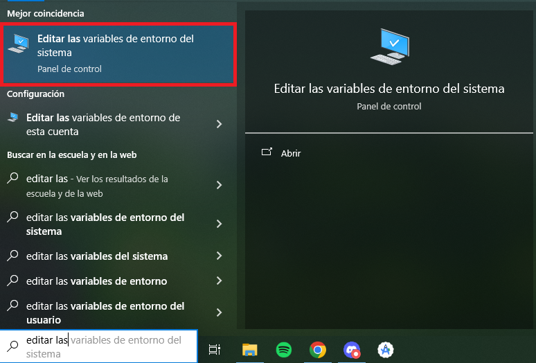
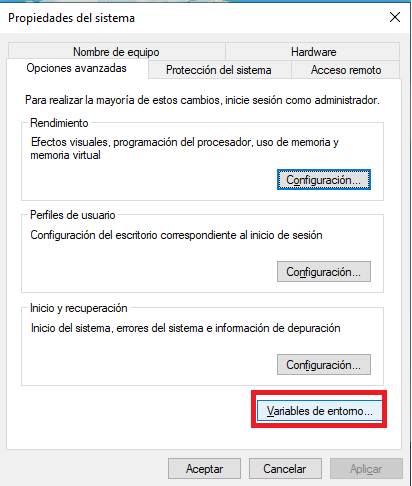
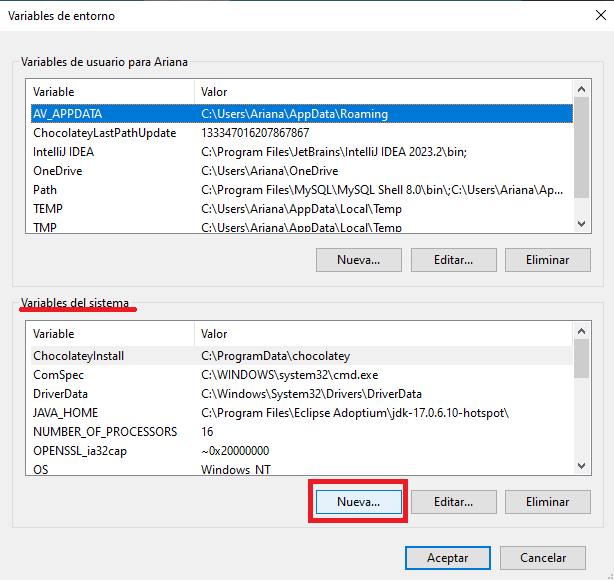
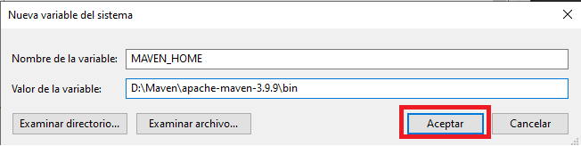
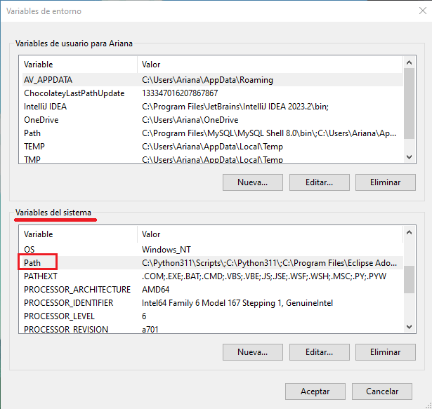
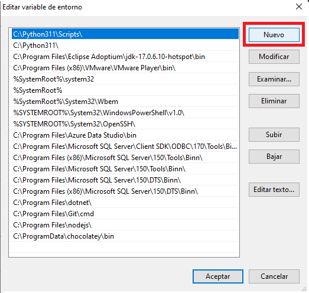
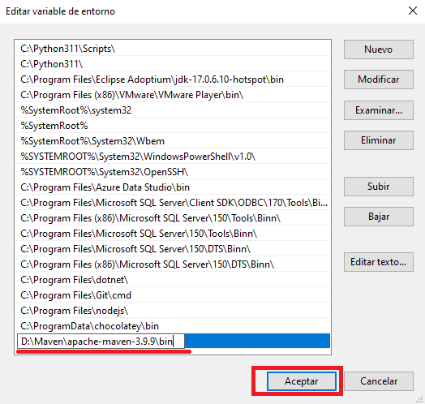

# sender-java

## Descripción
Este es un proyecto académico para la UADE, un paquete que permite la comunicación entre los distintos módulos a través del Core.

## Tabla de Contenidos
- [Instalación](#instalación)
- [Uso](#uso)
- [Ejemplo](#ejemplo)

## Instalación
Para instalar la libreria seguí estos pasos:

### Windows
1. Ingresá , descargá el archivo Squad1CoreSender-Java-V1.1.7z y descomprimilo en la carpeta que prefieras.
2. Ingresá a este enlace , descargá el archivo apache-maven-3.9.9-bin.zip y descomprimilo en la carpeta que prefieras.
3. En Windows Search buscá "Editar las variables de entorno del sistema" y seguí estos pasos:




Nombre de la variable: MAVEN_HOME, Valor de la variable: ruta al directorio bin del archivo que descomprimiste en el paso anterior (ej: D:\Maven\apache-maven-3.9.9\bin).





Ruta al directorio bin del archivo que descomprimiste en el paso anterior (ej: D:\Maven\apache-maven-3.9.9\bin).



### Linux
1. Ejecutá estas instrucciones en bash:
```bash
sudo apt update
sudo apt upgrade
sudo apt install maven
mvn -version
```

### Finalizando en ambos casos

1. Abrí Powershell/bash, en cualquier directorio que no sea el de Maven, y ejecutá los siguientes comandos:
```bash
mvn install:install-file -Dfile=<Ruta del archivo que descomprimiste en el primer paso>/sender-java-1.1.jar -DgroupId="ar.edu.uade" -DartifactId=sender-java -Dversion="1.1" -Dpackaging=jar

mvn install:install-file -Dfile=<Ruta del archivo que descomprimiste en el primer paso>/sender-java-1.1-javadoc.jar -DgroupId="ar.edu.uade" -DartifactId=sender-java -Dversion="1.1" -Dpackaging=jar -Dclassifier=javadoc

mvn install:install-file -Dfile=<Ruta del archivo que descomprimiste en el primer paso>/sender-java-1.1-sources.jar -DgroupId="ar.edu.uade" -DartifactId=sender-java -Dversion="1.1" -Dpackaging=jar -Dclassifier=sources
```
2. Agregá a tu archivo pom.xml las siguientes dependencias:
```xml
<dependency>
    <groupId>com.rabbitmq</groupId>
    <artifactId>amqp-client</artifactId>
    <version>5.22.0</version>
</dependency>

<dependency>
    <groupId>com.google.code.gson</groupId>
    <artifactId>gson</artifactId>
    <version>2.10.1</version>
</dependency>

<dependency>
    <groupId>ar.edu.uade</groupId>
    <artifactId>sender-java</artifactId>
    <version>1.0</version>
</dependency>
```

## Uso
Usá el proyecto de la siguiente manera:
1. Iniciá dos conexiones con el servidor, una será para enviar mensajes y la otra para recibirlos. 
La conexión te va a pedir especificar un host, un puerto, un usuario y una contraseña. Todos los datos te van a ser dados por el Squad del Core.
2. Definí una función de callback, o sea lo que va a hacer tu aplicación cada vez que reciba un mensaje. Esto te va a permitir procesarlo.
Es importante aclarar que los mensajes viajan en formato de bytes[], así que es necesario usar el método convertDelivery.
3. Iniciá el servicio consumidor dándole una conexión e indicándole cuál es tu módulo, el cual estará restringido por el enum Modules.
Es importante aclarar que invocar a esta función bloqueará un hilo de procesamiento para estar permanentemente a la escucha.
4. Por último, podés usar el método publish para enviar mensajes a cualquier módulo válido. También se encuentra restringido por el enum Modules.
Necesitarás ingresar por parámetro una conexión (distinta a la del servicio consumidor), el mensaje en formato String, el nombre del módulo de origen, el de destino y el caso de uso que genera al mensaje.
Recomendamos cerrar la conexión usada después de enviar un mensaje, o un lote de ellos, y abrir una nueva cuando vuelva a ser necesaria.

> [!CAUTION]
> ACLARACIÓN
> 1. Tené en cuenta que la conexión es un objeto del tipo AutoCloseable, por lo que deberías manejar las excepciones e implementar una lógica de reconexión.
> 2. Los mensajes pueden ser clases convertidas a un String de formato JSON ó valores sueltos en forma de Plain String. Nuestra recomendación es usar clases, como la vista de ejemplo, para un mejor manejo de la información.

## Ejemplo
```Java
package org.example;

import ar.edu.uade.*;
import com.rabbitmq.client.Connection;
import com.rabbitmq.client.Delivery;

public class Main {
    public static void main(String[] args) throws Exception {
        Broker broker = new Broker(
                System.getenv("HOST"),
                Integer.parseInt(
                        System.getenv("PORT")
                ),
                System.getenv("USER"),
                System.getenv("PASSWORD")
        );

        Connection consumerConnection = broker.startConnection();

        //Redefino el callback para los mensajes recibidos.
        Consumer consumer = new Consumer(new CallbackInterface() {
            @Override
            public void callback(String consumerTag, Delivery delivery) {
                //Body es la clase que encapsula a los datos enviados desde el módulo de origen.
                Body body = Utilities.convertDelivery(delivery);

                //Los datos enviados desde el módulo de origen se encuentran en el atributo payload del body.
                String datos = body.getPayload();

                //Los datos enviados desde el módulo de origen pueden convertirse a cualquier clase del modelo, si corresponde.
                try {
                    Usuario usuario = Utilities.convertBody(body, Usuario.class);
                } catch (ConverterException e) {
                    
                }
            }
        });

        //Comienza a consumir utilizando un hilo secundario
        consumer.consume(consumerConnection, Modules.USUARIO);

        Connection publisherConnection = broker.startConnection();

        //Crea la instancia para poder publicar un mensaje
        Publisher publisher = new Publisher(String.valueOf(Modules.USUARIO));

        Usuario usuario = new Usuario("Matias");

        //Convierto un objeto a un String de formato JSON.
        String mensaje = Utilities.convertClass(usuario);

        publisher.publish(publisherConnection, mensaje, Modules.USUARIO, "Prueba");

        broker.endConnection(publisherConnection);
    }
}
```
